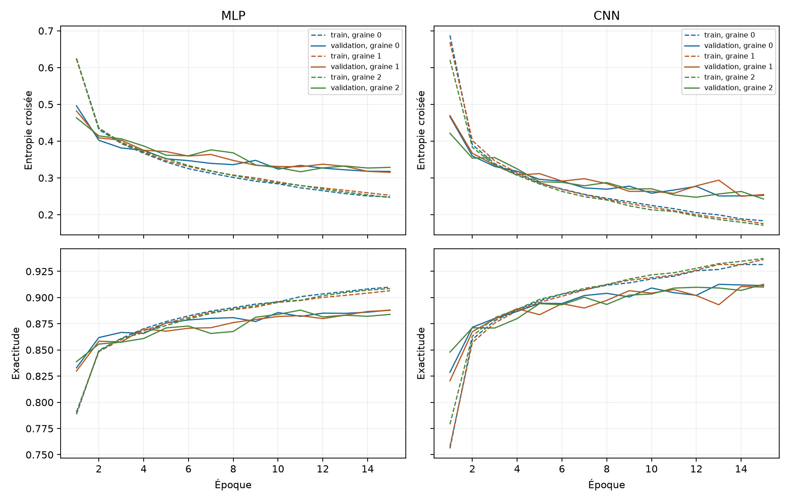

# Fashion-MNIST — comparer un réseau dense et un réseau convolutif

**Que change une architecture convolutive pour classer des images de vêtements,
à nombre de paramètres proche et nombre d'époques identique ?** Cette étude
compare un réseau dense (MLP) et un réseau convolutif (CNN) sur Fashion-MNIST,
en mesurant leurs performances, leurs erreurs, leur variabilité et leur temps
d'entraînement sur CPU.

C'est un **projet académique personnel de vision par ordinateur et d'apprentissage
supervisé**. Les deux modèles sont entraînés depuis une initialisation aléatoire
avec PyTorch. Le dépôt rassemble le code, le protocole et les résultats des six
entraînements, pour permettre de suivre la démarche et de reproduire l'expérience.

| L'expérience en quelques chiffres | |
|---|---|
| Données | Images 28 × 28 en niveaux de gris, dix catégories de vêtements et accessoires |
| Partition | 50 000 images d'entraînement, 10 000 de validation, 10 000 de test |
| Modèles | Un MLP de 101 770 paramètres et un CNN de 105 866 paramètres |
| Répétitions | Trois graines par modèle, quinze époques par entraînement |
| Évaluation | Exactitude, macro-F1, matrices de confusion et durée mesurée |
| Résultats archivés | Six historiques complets et six fichiers de prédictions sur le même test |
| Outils | Python, PyTorch, torchvision, NumPy, scikit-learn et Matplotlib |

[Résultats](#résultats) · [Erreurs](#ce-que-les-erreurs-montrent) ·
[Méthode](#méthode) · [Code](#lire-le-code-et-les-résultats-bruts) ·
[Reproduire](#reproduire) · [Limites et suite](#limites-et-suite)

## Résultats

**Dans cette expérience, le CNN classe mieux les images en moyenne, avec un
temps d'entraînement plus élevé.** Ce résultat porte sur les deux architectures
et les réglages décrits ci-dessous.

Les six entraînements de référence ont été exécutés le 14 septembre 2026 sur
un CPU Intel Xeon (Skylake), avec deux threads PyTorch. L'étude complète,
préparation et évaluation finale comprises, a duré environ 37 minutes.
Aucun de ces six entraînements n'a échoué et aucune graine n'a été écartée.

| Modèle | Paramètres mesurés | Exactitude test (%) | Macro-F1 test (%) | Durée par entraînement (s) |
|---|---:|---:|---:|---:|
| MLP | 101 770 | 87,89 ± 0,42 | 87,78 ± 0,38 | 194,75 ± 3,63 |
| CNN | 105 866 | 91,04 ± 0,38 | 91,01 ± 0,39 | 535,72 ± 5,84 |

Les valeurs sont les moyennes et écarts-types d'échantillon des trois graines,
pas des intervalles de confiance. Les [six résultats individuels et toutes les
figures](results/reference/report/README.md) sont conservés, avec leurs
[valeurs non arrondies](results/reference/report/runs.csv).

Dans ce protocole, le CNN dépasse le MLP pour les trois graines, avec un écart
moyen de **3,14 points d'exactitude**, pour une durée moyenne environ **2,75 fois
plus élevée**. Ses paramètres sont environ 4 % plus nombreux. L'observation est
compatible avec l'intérêt des filtres locaux partagés pour ces images ; cette
comparaison ne permet pas d'isoler l'effet de chaque couche ni de conclure à une
supériorité générale des CNN.



La perte d'entraînement baisse, tandis que la validation fluctue et progresse
moins régulièrement. Le MLP de graine 2 retient l'époque 11 : sa perte de
validation passe de 0,3168 à cette époque à 0,3286 à l'époque 15, malgré la
poursuite de la baisse de la perte d'entraînement. Les CNN de graines 0 et 1
retiennent respectivement les époques 13 et 14. Ces observations sont compatibles
avec un début de surapprentissage ; elles ne justifient pas un arrêt universel
à une époque donnée. Les quinze époques restent visibles pour chaque modèle.

## Ce que les erreurs montrent

La graine 0 a été choisie avant les expériences pour illustrer les erreurs.
Voici le rappel de **chacune des dix classes** pour cette graine, calculé depuis
les matrices de confusion : parmi les 1 000 images réelles d'une classe,
quelle proportion est correctement reconnue ?

| Classe | Rappel MLP (%) | Rappel CNN (%) |
|---|---:|---:|
| T-shirt | 88,2 | 88,8 |
| Pantalon | 97,3 | 97,7 |
| Pull | 79,3 | 81,4 |
| Robe | 91,0 | 93,5 |
| Manteau | 85,8 | 87,9 |
| Sandale | 93,8 | 97,1 |
| Chemise | 58,8 | 71,1 |
| Basket | 96,2 | 94,6 |
| Sac | 97,3 | 97,0 |
| Bottine | 95,8 | 98,0 |

La chemise reste la classe la moins bien reconnue pour les deux modèles de
graine 0. Le MLP classe 168 chemises comme T-shirts, contre 132 pour le CNN.
Les confusions entre pulls, manteaux et chemises restent fréquentes. Les petites
images monochromes présentent parfois des silhouettes proches ; cette lecture
visuelle ne constitue pas une mesure de la cause des erreurs.

L'amélioration globale ne se retrouve pas dans toutes les classes : le rappel
du CNN est inférieur pour les baskets et, légèrement, pour les sacs sur cette
graine. Les matrices des graines 1 et 2 restent accessibles dans le rapport ;
ce tableau ne résume pas leur variabilité.

Les [exemples d'erreurs](results/reference/report/README.md#exemples-derreurs)
sont tirés sans remise avec une graine fixée à l'avance. Aucun exemple n'est
sélectionné manuellement pour rendre un modèle plus convaincant.

## Méthode

### Données et séparation des usages

[Fashion-MNIST](https://github.com/zalandoresearch/fashion-mnist) contient
60 000 images d'apprentissage et 10 000 images de test de vêtements, chaussures
et sacs. Chaque image comporte 28 × 28 pixels en niveaux de gris et une étiquette
parmi dix classes. Chaque classe compte 6 000 images d'apprentissage et
1 000 images de test.

La partition officielle d'apprentissage est séparée de manière stratifiée en
50 000 images d'entraînement et 10 000 images de validation avec la graine 2026.
Cette partition est partagée par tous les entraînements et ses indices sont
enregistrés. Le test officiel n'intervient ni dans l'entraînement, ni dans le
choix du checkpoint. Les fichiers du test peuvent être téléchargés par
torchvision en même temps que l'apprentissage ; leur contenu n'est chargé pour
l'évaluation qu'après les six entraînements réussis.

Les pixels sont convertis en `float32` et divisés par 255. Il n'y a ni
augmentation, ni normalisation estimée sur les données.

### Deux architectures de capacité proche

| Modèle | Architecture |
|---|---|
| MLP | Aplatissement → dense 784–128 → ReLU → dense 128–10 |
| CNN | Convolution 1–16, 3 × 3 → ReLU → max-pooling 2 × 2 → convolution 16–32, 3 × 3 → ReLU → max-pooling 2 × 2 → aplatissement → dense 1568–64 → ReLU → dense 64–10 |

Les convolutions utilisent un padding de 1. Le MLP relie directement les pixels
à une couche dense ; le CNN partage des filtres sur les positions de l'image
et construit des représentations locales. Leurs sorties sont dix **logits** :
`CrossEntropyLoss` applique elle-même le calcul log-softmax nécessaire. Ajouter
un softmax avant cette perte serait incorrect.

Le nombre proche de paramètres limite une différence de capacité, mais ne rend
pas les modèles équivalents : le partage des poids, le pooling et la profondeur
changent aussi. L'expérience compare donc deux architectures complètes ; elle
n'isole pas l'effet de la convolution seule.

### Entraînement et sélection

| Réglage | Valeur fixée avant les expériences |
|---|---|
| Graines d'entraînement | 0, 1 et 2 pour chaque modèle |
| Budget | 15 époques par entraînement |
| Optimiseur | Adam, taux d'apprentissage 0,001 ; autres paramètres par défaut, weight decay nul |
| Taille des lots | 128, dernier lot conservé |
| Sélection | Plus faible perte de validation ; premier checkpoint en cas d'égalité |
| Calcul | CPU, deux threads PyTorch, aucun worker DataLoader |
| Régularisation | Aucun dropout ni augmentation |
| Réglages supplémentaires | Aucun ajustement d'hyperparamètres sur ces expériences |

Pour chaque graine, le MLP est entraîné puis le CNN. Un générateur PyTorch dédié
au mélange des exemples rend l'ordre des lots indépendant du nombre de tirages
consommés lors de l'initialisation des modèles. La validation ne mélange pas les
exemples. Les graines Python, NumPy et PyTorch sont fixées et les opérations
déterministes sont activées.
Le point d'entrée fixe aussi `MKL_CBWR=COMPATIBLE` avant les opérations numériques
pour stabiliser la branche de calcul MKL sur CPU.

Les six checkpoints sont sélectionnés avant toute évaluation finale. Tous sont
ensuite évalués sur les 10 000 images du test. L'exactitude est la métrique
principale ; le macro-F1 donne le même poids à chaque classe. Les résultats
individuels précèdent les moyennes et écarts-types d'échantillon (`ddof=1`).

La durée mesurée couvre l'entraînement, la validation, les historiques et les
sauvegardes pendant les époques. Elle exclut le téléchargement, l'initialisation
et le test final. Les temps par époque sont également conservés, hors écriture
des historiques et checkpoints. Ces mesures proviennent d'une machine partagée.

## Reproduire

Environnement de référence : Python 3.12.3 sur Linux x86_64, versions CPU de
PyTorch et torchvision. Les dépendances directes et transitives sont figées
dans [requirements.txt](requirements.txt).

```bash
git clone https://github.com/KenziBoughadou/fashion-mnist-study.git
cd fashion-mnist-study
python3.12 -m venv .venv
source .venv/bin/activate
python -m pip install -r requirements.txt
python -m pytest -q
python experiments.py --smoke
python experiments.py
```

Si la distribution ne fournit pas `ensurepip`, créer l'environnement avec
`python3.12 -m venv --without-pip .venv`, puis y installer pip selon la
[méthode officielle](https://pip.pypa.io/en/stable/installation/#get-pip-py).
Exécuter le script d'installation avec `.venv/bin/python`, pas avec le Python système.

Le premier lancement télécharge les données. Chaque étude crée un nouveau dossier
horodaté et affiche son chemin. Pour fixer explicitement un emplacement :

```bash
python experiments.py --output-dir results/ma-reproduction
python report.py --results-dir results/ma-reproduction
```

Pour reconstruire le rapport inclus dans le dépôt, sans relancer l'étude :

```bash
python report.py --results-dir results/reference
```

Un dossier existant est refusé : une nouvelle exécution ne remplace jamais une
tentative précédente. `--data-dir` permet de choisir le cache des données.
Le mode `--smoke` utilise 1 024 exemples d'entraînement, 256 de validation,
deux époques et la graine 0 pour chaque modèle. Il n'évalue jamais le test officiel.
Ses sorties locales sont séparées des résultats scientifiques.

Le rapport se régénère sans entraînement, sans checkpoint et sans téléchargement :
il lit les mesures et les petits échantillons d'erreurs conservés. Ses tableaux
et figures dérivés peuvent être remplacés ; les résultats bruts restent inchangés.

## Lire le code et les résultats bruts

- [data.py](data.py) : téléchargement, séparation stratifiée et DataLoader.
- [models.py](models.py) : les deux architectures.
- [training.py](training.py) : boucles d'entraînement et d'évaluation.
- [experiments.py](experiments.py) : protocole, enregistrement et évaluation finale.
- [report.py](report.py) : tableaux et figures depuis les fichiers enregistrés.
- [tests/test_study.py](tests/test_study.py) : contrôles des points susceptibles de fausser l'étude.

Chaque dossier d'étude contient le protocole, les indices de partition, le statut,
les versions installées, le matériel et les empreintes SHA-256 du code expérimental.
Chaque sous-dossier modèle/graine contient sa configuration, son historique par
époque, son statut, le checkpoint retenu localement et les mesures finales.
Les prédictions CSV donnent l'indice officiel de test, la classe réelle et la
classe prédite ; les matrices de confusion gardent les effectifs bruts.

Le dépôt inclut les mesures, les tableaux et les figures. Le jeu complet,
l'environnement virtuel et les checkpoints sont exclus de Git. Les images
d'erreurs distribuées sont accompagnées de leur [notice](THIRD_PARTY_NOTICES.md).

## Échecs et vérifications

Une exception d'entraînement laisse le journal déjà écrit, son statut et la cause
observée. Les autres entraînements sont tentés, mais aucune évaluation finale
n'a lieu si l'un d'eux échoue. Une interruption interceptable est enregistrée.
Après un arrêt brutal non interceptable, un statut resté actif ne doit pas être
interprété comme une réussite. Le rapport liste aussi les exécutions échouées
ou non démarrées et indique les comparaisons incomplètes.

Les tests vérifient les partitions disjointes et stratifiées, le mélange commun,
les dimensions, la mise à jour des poids, le rechargement d'un checkpoint,
la pondération des pertes et l'absence d'accès au test avant la fin des entraînements.
Ils couvrent aussi la conservation des échecs, le refus d'écrasement, la sélection
par validation et l'agrégation de toutes les graines.
Les 12 tests ont été exécutés avec succès. Deux essais courts indépendants avec
le réglage final ont produit des poids et des métriques identiques pour les deux
modèles ; les durées ne font pas partie de cette comparaison d'identité.
Le rapport final a été régénéré à l'identique sans modifier les mesures ni les
checkpoints. Les métriques ont aussi été recalculées depuis les six fichiers de
prédictions et les empreintes du code vérifiées contre celles enregistrées au lancement.

Une première vérification a échoué sur l'identité bit à bit de deux entraînements
synthétiques du MLP à graine identique. Un contrôle a mesuré un écart absolu
maximal de `3,1851 × 10⁻⁷` sur la première matrice de poids ; une tolérance
absolue de `10⁻⁷` ne suffisait pas. Les contrôles isolés ne reproduisaient pas
systématiquement l'écart. Le mode MKL `COMPATIBLE` a été introduit avant les
expériences complètes après des contrôles réussis avec ce réglage. Le mécanisme
précis de l'écart initial n'est pas établi. Le test conserve une comparaison
stricte des poids ; sa réussite locale ne garantit pas l'identité numérique
sur une autre machine ou une trajectoire complète de quinze époques.

## Limites et suite

- Trois graines sur une partition fixe mesurent une partie de la variabilité
  de l'entraînement, pas celle du choix des données. L'écart-type n'est pas
  un intervalle de confiance.
- Quinze époques représentent le même nombre de passages sur les données,
  pas le même budget de calcul ni une garantie de convergence.
- Le nombre de paramètres est proche, pas identique. La comparaison porte sur
  ces deux architectures et ces réglages, pas sur toutes les familles MLP et CNN.
- Les hyperparamètres ne sont pas optimisés séparément pour chaque modèle.
- Les mêmes images sont évaluées pour les trois graines ; ces prédictions
  répétées ne forment pas 30 000 observations indépendantes.
- Les petites images vestimentaires monochromes ne représentent pas toute
  la vision par ordinateur. Aucune robustesse hors distribution n'est mesurée.
- Les graines et versions fixées réduisent les sources de variation sans garantir
  l'identité numérique entre plateformes, versions ou bibliothèques de calcul.

Pour prolonger cette étude, une première expérience pourrait comparer les deux
modèles à durée de calcul fixée, puis examiner l'effet d'une seule modification
à la fois, par exemple le dropout ou une augmentation des images. Le choix des
réglages devrait utiliser la validation, avec un protocole défini avant les essais.
Ces pistes n'ont pas été exécutées et aucun gain n'est établi.

Le test actuel ayant déjà été observé, des essais complémentaires sur ce même
test devront être présentés comme exploratoires. Une confirmation indépendante
demanderait de nouvelles données tenues à l'écart des décisions de développement.

## Références

- Xiao, Rasul et Vollgraf (2017), [Fashion-MNIST](https://arxiv.org/abs/1708.07747).
- [Données et description officielles](https://github.com/zalandoresearch/fashion-mnist).
- PyTorch, [boucle d'optimisation](https://docs.pytorch.org/tutorials/beginner/basics/optimization_tutorial.html).
- PyTorch, [reproductibilité](https://docs.pytorch.org/docs/stable/notes/randomness.html).
- Intel, [reproductibilité numérique conditionnelle de MKL](https://www.intel.com/content/www/us/en/docs/onemkl/developer-reference-c/2026-0/getting-started-with-conditional-numerical.html).
