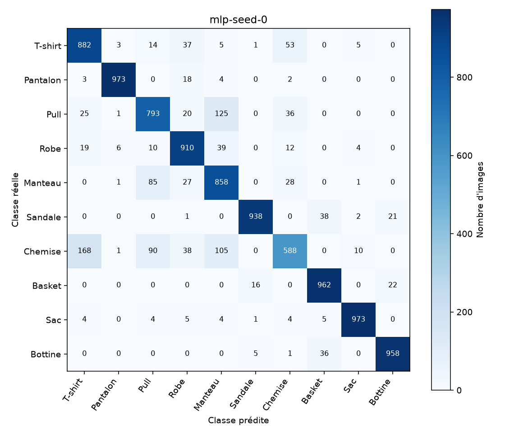
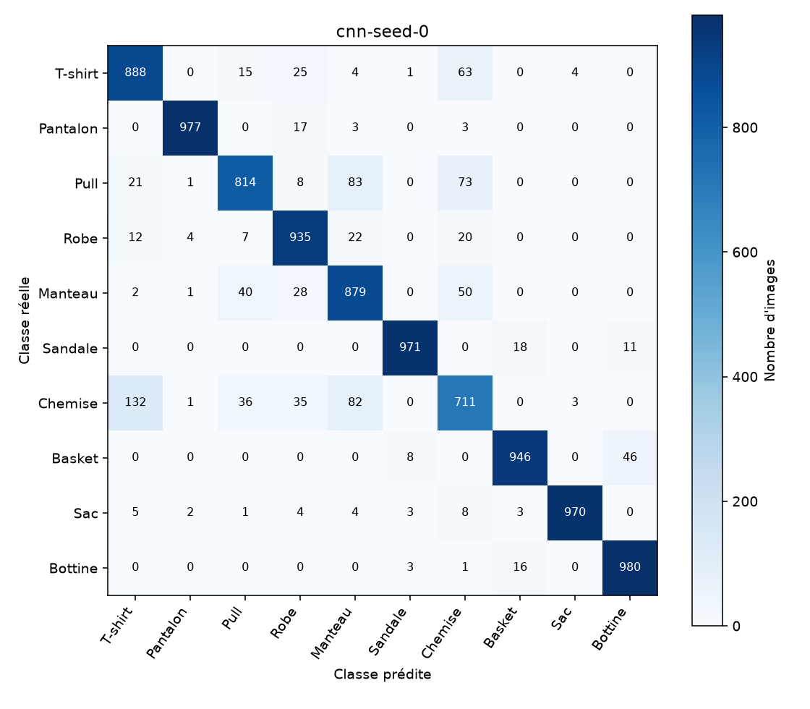
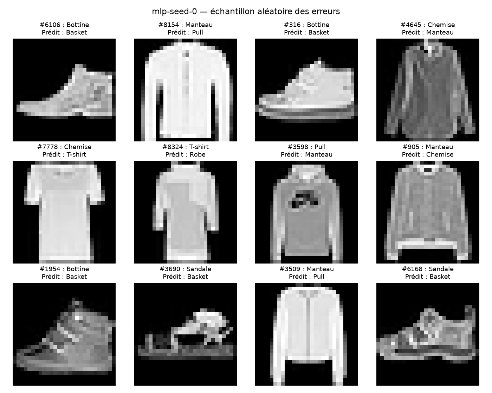
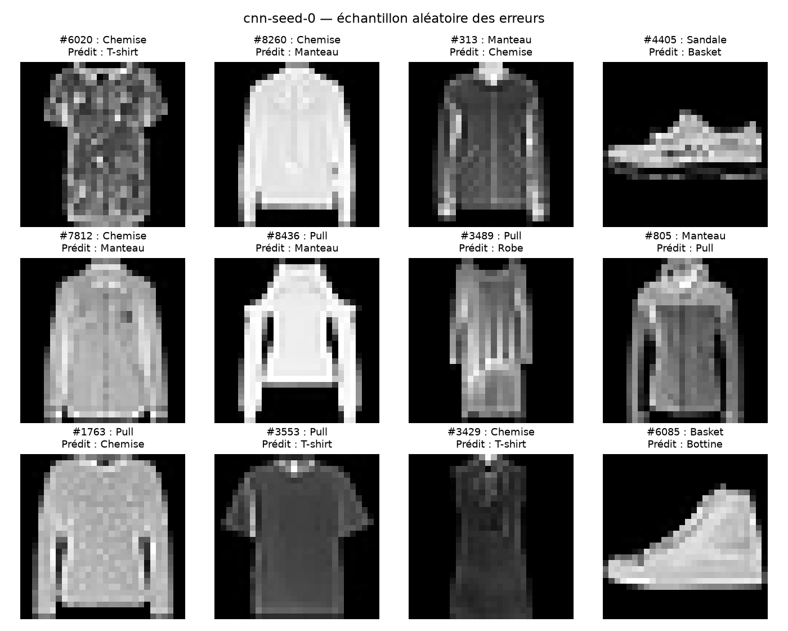

# Résultats Fashion-MNIST

Statut enregistré : **complete**.

## Toutes les exécutions

| Modèle | Graine | Statut | Époque retenue | Paramètres | Exactitude (%) | Macro-F1 (%) | Durée (s) |
|---|---:|---|---:|---:|---:|---:|---:|
| mlp | 0 | complete | 15 | 101770 | 88.35 | 88.16 | 197.21 |
| cnn | 0 | complete | 13 | 105866 | 90.71 | 90.67 | 542.27 |
| mlp | 1 | complete | 15 | 101770 | 87.80 | 87.76 | 196.45 |
| cnn | 1 | complete | 14 | 105866 | 90.94 | 90.92 | 533.80 |
| mlp | 2 | complete | 11 | 101770 | 87.53 | 87.41 | 190.58 |
| cnn | 2 | complete | 15 | 105866 | 91.46 | 91.43 | 531.08 |

## Moyennes et variabilité

Moyenne ± écart-type d'échantillon (`ddof=1`) des exécutions terminées. Ces écarts décrivent les graines sur une partition fixe, pas un intervalle de confiance.

| Modèle | Exécutions | Exactitude (%) | Macro-F1 (%) | Durée (s) |
|---|---:|---:|---:|---:|
| mlp | 3/3 | 87.89 ± 0.42 | 87.78 ± 0.38 | 194.75 ± 3.63 |
| cnn | 3/3 | 91.04 ± 0.38 | 91.01 ± 0.39 | 535.72 ± 5.84 |

La durée couvre les époques d'entraînement et de validation, l'écriture des historiques et des checkpoints. Elle exclut le téléchargement, l'initialisation et le test final.

## Courbes

L'exactitude d'entraînement est mesurée au fil des mises à jour des poids ; celle de validation est mesurée en fin d'époque avec des poids fixes.

## Matrices de confusion

Chaque matrice correspond à une graine. Les prédictions répétées sur les mêmes images ne sont pas traitées comme des observations indépendantes.

## Exemples d'erreurs

La graine d'entraînement 0 et la graine d'échantillonnage 2026 ont été fixées avant les expériences. Jusqu'à 12 erreurs sont tirées sans remise par modèle. Les numéros sont les indices du test officiel.

Images : Fashion-MNIST, Zalando SE. Voir la notice de licence du dépôt.
